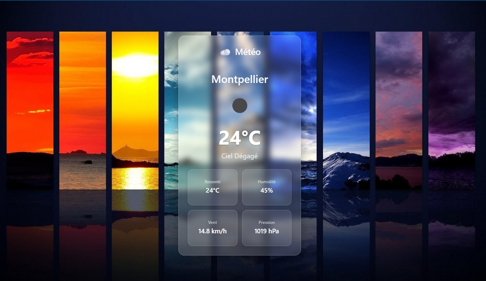

# Météoscop



# Affichage Météo pour Transports en Commun

Ce projet a été développé dans le cadre de la préparation à la journée de sélection pour le parcours de formation "Concepteur Développeur d’Applications". L'objectif est de créer une interface web simple et lisible affichant la météo actuelle pour une ville donnée, destinée aux écrans d'information dans les transports en commun.

## Fonctionnalités

- **Affichage de la météo actuelle** : Température, description du ciel, icône météo, ressenti, humidité, vitesse du vent et pression.
- **Configuration par fichier JSON** : Le nom de la ville est lu depuis un fichier `conf.json`, éliminant le besoin de saisie manuelle ou de moteur de recherche.
- **Mise à jour automatique** : Les données météo sont rafraîchies toutes les heures.
- **Design moderne et épuré** : L'interface utilise un effet de "glassmorphism" pour une meilleure intégration visuelle sur les écrans.

## Technologies Utilisées

- **HTML5** : Structure de l'interface.
- **CSS3** : Stylisation et mise en page (incluant le "glassmorphism" et le responsive design de base).
- **JavaScript (ES6+)** : Logique de l'application, récupération des données via l'API, manipulation du DOM.
- **API OpenWeatherMap** : Source des données météo en temps réel.
- **Git & GitHub** : Gestion de version et hébergement du projet.

## Démarrage Rapide

Pour faire fonctionner ce projet en local :

1.  **Clonez le dépôt :**

    ```bash
    git clone https://github.com/ualtas/meteoscope.git
    cd meteoscop
    ```

2.  **Obtenez une clé API OpenWeatherMap :**

    - Rendez-vous sur [OpenWeatherMap](https://openweathermap.org/) et créez un compte.
    - Récupérez votre clé API depuis votre tableau de bord (section "API keys").

3.  **Configurez la ville et la clé API :**

    - Ouvrez le fichier `conf.json` et remplacez `"Montpellier"` par la ville de votre choix :
      ```json
      {
        "city": "VotreVille"
      }
      ```
    - Ouvrez le fichier `meteo.js` et remplacez `VOTRE_CLE_API_OPENWEATHERMAP` par votre clé API OpenWeatherMap :
      ```javascript
      const API_KEY = "VOTRE_CLE_API_OPENWEATHERMAP"; // <<<<< REMPLACEZ CECI PAR VOTRE VRAIE CLÉ API
      ```

4.  **Lancez un serveur web local et ouvrez l'application :**

    - Assurez-vous d'avoir **Python** installé sur votre machine.
    - Ouvrez votre terminal (ligne de commande) et naviguez jusqu'au dossier racine de votre projet.
    - Exécutez la commande suivante :
      ```bash
      python -m http.server 8000
      ```
    - Ensuite, ouvrez votre navigateur web et accédez à l'adresse :
      `http://localhost:8000`

    **Pourquoi c'est mieux :**

    - **Gestion de CORS :** En servant le fichier via un serveur HTTP, les requêtes fetch vers conf.json et l'API OpenWeatherMap ne seront pas bloquées par les politiques de sécurité du navigateur, qui considèrent l'accès direct aux fichiers locaux comme une "origine différente".
    - **Environnement de développement réaliste :** C'est ainsi que les applications web sont généralement servies en production, ce qui vous donne une meilleure idée de la façon dont elle se comportera.
    - **Simplicité :** Python est souvent préinstallé, et lancer ce serveur minimal est très rapide et facile.
      Assurez-vous que Python est bien installé sur le système où vous voulez faire tourner l'application.

## 💡 Améliorations Possibles

Ce projet peut être étendu de plusieurs manières :

- **Gestion des erreurs améliorée** : Afficher des messages plus spécifiques en cas d'échec de l'API (ville introuvable, problème de connexion, etc.).
- **Icônes personnalisées** : Utiliser un jeu d'icônes plus intégré au design ou générer des icônes dynamiquement.
- **Prévisions à court terme** : Intégrer les prévisions pour les prochaines heures ou jours.
- **Multilingue** : Permettre de changer la langue d'affichage des informations.
- **Chargement dynamique des images d'arrière-plan** : Adapter l'image d'arrière-plan en fonction des conditions météorologiques actuelles.

---

N'hésitez pas à poser des questions ou à proposer des améliorations !
